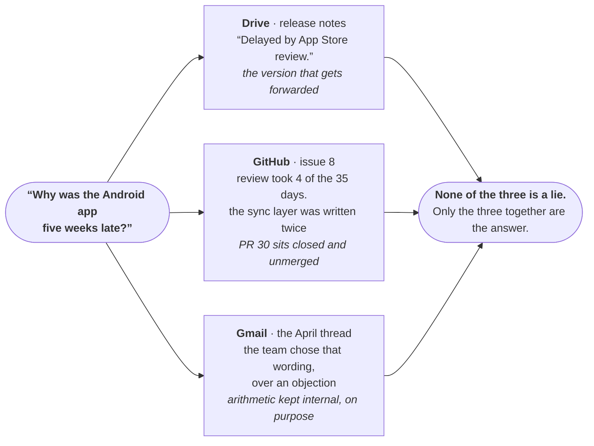
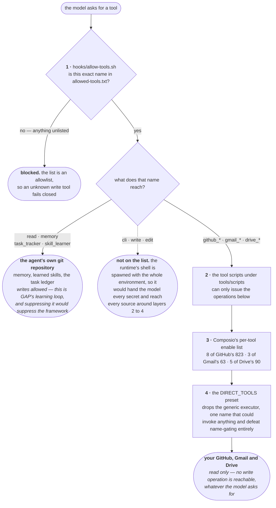
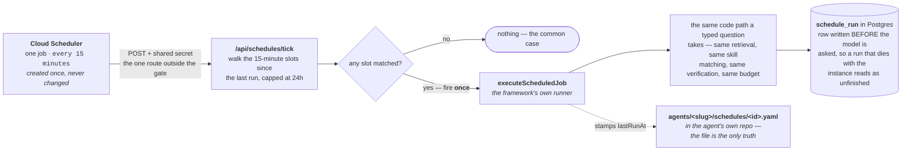

# Badger

**A workplace search agent — Glean's shape, built on [OpenGAP](https://www.gitagent.sh/).**

Ask a question in plain English. Badger searches your GitHub, Gmail and Google
Drive, opens the threads worth reading, and answers with citations it then
verifies against what it actually retrieved.

**Live:** https://badger-1033557908241.us-central1.run.app — the passphrase
travels with the submission, not with this repository.

---

## Features

- **Federated search across three sources** — GitHub, Gmail and Drive, merged
  on one locally computed score, because three engines' own rankings are not
  comparable.
- **A local index, with live fallback** — BM25 with real IDF and trigram typo
  correction. 3ms against ~5s live, falling back to the live fan-out when the
  index is missing or stale.
- **Citations that are checked** — every citation is matched against the tool
  output that produced it. Anything Badger did not retrieve is marked
  `[UNVERIFIED]` in the answer rather than quietly presented as fact.
- **Read-only, enforced at four layers** — with an honest admission that the
  credential underneath is not read-only and cannot be.
- **Sub-agents** — narrower agents with their own tools, skills and memory.
  `hr-badger` reads Drive and mail; `eng-badger` reads GitHub and cannot see
  either.
- **Schedules** — give a sub-agent an interval and a question and it runs
  unattended. Every run is kept and readable.
- **A measured eval** — fifteen questions with known answers, graded
  deterministically. Latest: **14/15 for $0.18**
  ([`evals/RESULTS.md`](evals/RESULTS.md)).

## Try it

The demo corpus is a fictional clinic-booking company, seeded across all three
sources. These three are where the point of the thing is visible:

| Ask it | Why this one |
|---|---|
| *Why was the Android app five weeks late?* | Three sources answer differently, and only the disagreement is the truth. A good answer does **not** blame App Store review. |
| *Did we tell Brightsmile the app would be ready in March?* | Mail answers it and nothing else records it. A customer was given a date sixteen days before the VP was told it would not hold. |
| *What is the leave carry-over policy?* | Drive says 10 days expiring in March; the GitHub handbook still says 5 with no deadline. Returning one and not the other is lying by omission. |

The product thesis in one picture — the answer exists, but not where you would
look, and no single source holds it:



---

## Built on OpenGAP: the agent *is* the repository

This is the framework's central claim, and the layout is the argument for it.
Badger's identity, rules, procedures and tools are version-controlled files
rather than application code — you can read the whole agent with `cat`, and
`git log` shows what it has learned.

```mermaid
flowchart LR
    subgraph REPO["<b>the agent</b> — files the gitagent runtime loads"]
        direction TB
        Y["<b>agent.yaml</b><br/>identity, model, compliance"]
        S["<b>SOUL.md · RULES.md · DUTIES.md</b><br/>who it is, what it must never do,<br/>read-only as a role policy CI checks"]
        K["<b>skills/</b> — 4 procedures by task<br/><i>plus whatever it learns itself</i>"]
        T["<b>tools/</b> — 10 declarative YAML tools<br/><i>implementations in tools/scripts/</i>"]
        H["<b>hooks/</b> — the allowlist, by exact name"]
        M["<b>memory/</b> — the agent's own notebook"]
        A["<b>agents/</b> — sub-agents, each a full<br/>agent folder one level down"]
    end

    REPO --> RT["<b>gitagent runtime</b><br/><code>query({ dir })</code>"]
    RT --> ANS(["an answer, with verified citations"])
    RT -.->|"commits back:<br/>learned skills, memory"| REPO

    subgraph APP["<b>the product</b> — a consumer, not a component"]
        direction TB
        SRV["<b>app/server</b> — the two passes, the gate,<br/>ranking, verification, the scheduler tick"]
        WEB["<b>app/web</b> — Vite · React · Tailwind · shadcn"]
    end

    APP -->|"reaches up, never the reverse"| REPO
```



**The dependency is strictly one-way, and it is tested rather than asserted.**
`npm run check:agent` greps for any reference from the agent down into `app/`,
then copies *only* the agent files to a temp directory and runs a tool there.
Clone this repo and run it with the gitagent CLI alone and it works — which is
what "the agent is a git repo" has to mean to be worth saying.

### Skills decompose by task, never by source

`trace-decision`, `find-expert`, `onboard-to-project`, `recent-activity` — named
for what a person is trying to do. Adding Gmail did not add a skill; it added
tools. A `search-gmail` skill would have made the taxonomy a map of the
integrations rather than of the work.

`agent.yaml` deliberately does **not** list them. `loader.js:194` treats that
key as a hard filter over what it discovers on disk, so listing them would hide
every skill the agent learns for itself and every skill a user adds.

### The learning loop is real, and it commits

`query({ repo })` runs the agent from a clone of its own repository on a
long-lived `gitagent/learning` branch. Confidence counters, crystallised skills
and self-written memory become commits a human reads and merges — never
straight to `main`. That is OpenGAP's own human-in-the-loop pattern, and the
branch currently carries skills the agent wrote for itself, `draft-delay-reply`
among them, after questions it expected to see again.

### Sub-agents, and a tool list that is enforcement

`agents/` holds two sub-agents in the spec's directory form (§13), each with
its own `agent.yaml`, `SOUL.md`, `tools/`, `skills/` and `memory/`. A
sub-agent's `tools/` directory **is** its tool schema:

```
$ node -e "…loadDeclarativeTools('agents/hr-badger')"
["drive_comments","drive_file","drive_search","gmail_search","gmail_thread"]
```

`hr-badger` cannot read GitHub. Not "instructed not to" — the tools are absent
from the model's schema, the same enforcement as the read-only allowlist rather
than a weaker one.

**Routing is the server's, not the model's.** The runtime implements delegation
as a shell-out through the `cli` tool (`agents.js:80`) — a shell Badger removes
from the model's schema, because anyone can email the demo mailbox and a shell
hands a stranger every secret in the container. So the server calls
`query({ dir: "agents/<slug>" })` itself. That is the spec's
`delegation.mode: router`, implemented by the consumer because the runtime
ships no router.

---

## How a question is answered

Two passes — the split Glean and Onyx both use, read from Onyx's source rather
than its docs. Results appear immediately; the answer arrives beside them.


---

## Read-only, and the honest limit

Badger never sends, writes, edits, deletes or shares. That holds at four
independent layers, and the diagram forks on the question that matters: **what
does that tool name actually reach?**



**All four layers are software. The credential underneath is not read-only, and
cannot be.** Composio's GitHub toolkit offers OAuth only, and GitHub has no
read-only OAuth scope for private repositories — `repo` is the narrowest scope
that can read one, and it grants write. So enforcement *has* to live in the
tool layer, which is why there are four of them and why the allowlist is by
exact name.

**Allow-by-name, not deny-by-verb.** The audit that settled it is the argument:
a "does this sound like a write?" regex over Drive's 90 tools classified
`GOOGLEDRIVE_EDIT_FILE` as read-only.

Read-only is **phase 1 of three**, not a missing feature — Glean itself ships
85+ write actions. Phase 2 is propose-don't-execute, where Badger drafts the
reply and hands it over; phase 3 is real writes, each a deliberate allowlist
addition with its own credential scope.

---

## Schedules: an agent running with nobody watching

Give a sub-agent an interval and a question and it runs on its own. Every run
is stored and opens with the same answer, step trail and citations the
Playground would have shown.



**The framework's scheduler, used as the library it is.** `dist/schedules.js`
and `dist/schedule-runner.js` are complete and exported — and `startScheduler`
has **no caller anywhere in `dist/`**. That matters for a hosting reason: Cloud
Run scales to zero, so an in-process cron would sit in a process that is not
running when it should fire. One Cloud Scheduler job triggers it instead, so a
schedule lives in a file and nowhere else. Per-schedule cloud jobs would have
needed a credential that writes to our own infrastructure, granted to a service
account whose entire story is that it only reads.

Intervals are bent to cron on purpose — the runtime's schedule is cron-only and
silently drops any key it does not recognise, so rather than fork the file
format the dropdown offers only what cron expresses faithfully. Times are
**India Standard Time everywhere, stated on screen**: a schedule belongs to the
agent, not to the browser that made it.

---

## Running it

```bash
npm run serve          # the web product on :4000
npm run ask "…"        # the SDK path, with citation verification
npm run eval           # 15 questions with known answers
npm test               # 165 deterministic tests — no keys, no network
npm run check:agent    # proves the agent still stands alone
npm run validate       # opengap validate --compliance
```

**The framework-native route**, the same as any agent on the registry:

```bash
git clone https://github.com/alanmathews9/badger && cd badger && npm install
cp env.template .env
npx @open-gitagent/gitagent --dir . -p "why was the app five weeks late?"
```

**Or any assistant harness as the brain** — no Google Cloud, no model key:

```bash
COMPOSIO_API_KEY=<your-key> claude "Be Badger — follow AGENTS.md."
```

`AGENTS.md` is GAP's framework-agnostic entry point: it tells any harness how
to be Badger, including how to call each tool script directly. Codex reads it
unprompted. The model is swappable; the door to the data is not, and read-only
survives any swap because the tool scripts can only issue read operations
whatever the brain asks for.

## Hosting

Google Cloud Run — a free HTTPS URL with no domain to buy, and Vertex
credentials from the service identity so **no model API key exists anywhere**.
`--max-instances 1` caps cost absolutely and makes the in-memory rate limits
correct, since they are per instance. Six secrets in Secret Manager, never as
plain environment variables.

Both `--set-env-vars` and `--set-secrets` **replace** the whole set rather than
adding to it, so derive the deploy command from
`gcloud run services describe badger --format=json` rather than from anything
written down. Dropping `DATABASE_URL` silently kills Postgres, and the service
still starts and still answers.

---

## Repository map

```
agent.yaml              identity, model, runtime config, compliance
SOUL.md  RULES.md       who Badger is, and what it must never do
DUTIES.md               read-only stated as a role policy CI can check
skills/                 4 procedures by task, plus whatever it learns
tools/*.yaml            10 tools; implementations in tools/scripts/
agents/                 sub-agents, each with its own tools, skills, schedule
hooks/allowed-tools.txt the allowlist, and the single source of truth for it
compliance/             risk assessment, control map, review schedule
app/server/  app/web/   the product — a consumer of the agent, never the reverse
migrations/  tests/     Postgres schema; 165 deterministic tests
evals/                  15 questions with known answers and known sources
docs/                   the research record — below
```

## Where the depth lives

Everything above is the summary. The reasoning is written down, because on a
project like this the reasoning is worth more than the conclusions.

- **[`docs/FRAMEWORK-DEFECTS.md`](docs/FRAMEWORK-DEFECTS.md)** — thirteen
  defects found by building on gitagent 2.1.0, each with a `file:line` proof
  read out of the *installed* runtime, a worked example and the upstream fix.
  The skill matcher that can never clear its own threshold. The `"Success"`
  string comparison that ends the learning loop silently. Multi-agent
  composition, specified and schema'd and implemented nowhere. A scheduler that
  is complete and started by nothing.
- **[`docs/UPSTREAM.md`](docs/UPSTREAM.md)** — the longer reproductions, each
  built from a clean two-file agent.
- **[`docs/RESEARCH-GAP-IDIOM.md`](docs/RESEARCH-GAP-IDIOM.md)** — how the
  framework's authors actually write agents, read from 17 of their published
  repositories plus the formal spec.
- **[`docs/NOTES.md`](docs/NOTES.md)** — what the installed runtime does, which
  has differed from the published documentation every time it has mattered.
- **[`evals/RESULTS.md`](evals/RESULTS.md)** — dated runs: the score, the
  failure, and why it failed.

## Known limits

Stated here rather than left to be discovered.

- **The credentials are not read-only.** Four software layers enforce it; the
  tokens beneath them could write.
- **No semantic search.** The index buys typo tolerance and real BM25;
  embeddings are deferred, so "holiday" does not find "leave policy" on the
  search path. The agent covers that gap by rephrasing.
- **Answers are not deterministic.** The same question can produce a materially
  different answer between runs, which is why the eval is quoted with a dated
  record behind it rather than as a single number.
- **Citation verification proves retrieval, not accuracy.** It catches an
  invented source. It cannot catch a real source misread.
- **History is per browser, not per person.** The key is a random id minted per
  sign-in with no account behind it, and there is deliberately no user table —
  modelling a user would be a claim the product cannot honour behind one shared
  passphrase.
- **Schedules run no faster than every fifteen minutes**, and a missed window
  fires once rather than once per slot missed. A redeploy does not queue up
  four stale digests.
- **The gate is a passphrase, not authentication.** One shared secret, so
  everything behind it is shared too.
