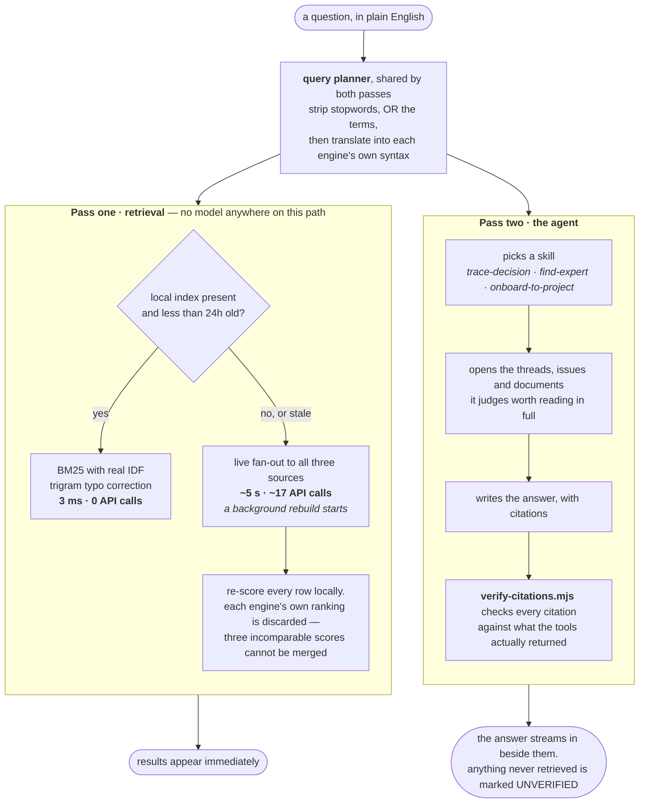

# Badger

A workplace search agent — Glean's shape, built on [GAP](https://www.gitagent.sh/).

Ask a question in plain English. Badger searches your GitHub, your Gmail and
your Google Drive **at the moment you ask**, opens the threads that look
relevant, and answers with citations it then verifies against what it actually
retrieved.

**Live:** https://badger-1033557908241.us-central1.run.app — the passphrase
travels with the submission rather than in this repository.

### Three questions to ask it

The demo corpus is a fictional clinic-booking company across all three sources.
These three are where the point of the thing is visible:

| Ask it | Why this one |
|---|---|
| *Why was the Android app five weeks late?* | Three sources answer differently and only the disagreement is the truth. A good answer does **not** blame App Store review. |
| *Did we tell Brightsmile the app would be ready in March?* | Mail answers it and nothing else records it. A customer was given a date sixteen days before the VP was told it would not hold. |
| *What is the leave carry-over policy?* | Drive says 10 days expiring in March; the GitHub handbook still says 5 with no deadline. Returning one and not the other is lying by omission. |

### If you have five minutes

1. **[The question this was built to answer](#the-question-this-was-built-to-answer)** — the product thesis in one diagram.
2. **[Read-only, and the honest limit](#read-only-and-the-honest-limit)** — enforcement at four layers, and a plain admission that the credential underneath is not read-only and cannot be.
3. **[Measuring whether the answers are right](#measuring-whether-the-answers-are-right)** — fifteen questions with known answers, graded deterministically, and what still fails.
4. **[Known limits](#known-limits)** — everything wrong with it, written down before you find it.

If you have one minute instead, read the second and third of those. They are
the two things this project is actually about.

### Running it

```
./scripts/badger.sh -p "Who knows about payments?"          # CLI
npm run ask "Why was the Android app five weeks late?"      # SDK, with verification
npm run serve                                               # web UI on :4000
npm run eval                                                # 15 questions with known answers
```

No Google Cloud, no UI, just the agent in your own assistant? One secret and
one command — see [Running it with a different brain](#running-it-with-a-different-brain).

---

## The question this was built to answer

Every company has a version of this problem: the answer exists, but not where
you would look, and no single system holds all of it.

Arkind sells appointment booking to small clinics — dentists, physios and vets,
so patients can book online, get a reminder and leave a deposit. Forty people,
Bengaluru and Lisbon. The worked example is an Android release that shipped five
weeks late. Ask **"why was the app five weeks late?"** and three sources answer
differently:


None of those is a lie. The Drive document is the one that gets forwarded, and
it is the one that teaches the wrong lesson.

Then ask **"did we tell Brightsmile the app would be ready in March?"** — which
mail answers and nothing else records. Tomas wrote "early March" to the customer
on 4 February, sixteen days before telling his own VP the date would not hold.
No document knows this happened. That is the thing a single-source tool cannot
do, and it is why the demo has three sources rather than one with more content
in it.

**Why a clinic booking company and not a consultancy.** The first corpus was a
consultancy, and it had to be thrown away. Consultancy work is abstract — scope,
weeks, billing — so every answer needed a glossary and a reader could not tell a
good answer from a bad one. "Why did the engagement slip?" was answered with
compressed discovery and unpriced change requests, and nobody can judge that. A
reminder text arriving at 3am is wrong in a way anyone can judge in one second.
Legibility was the point; sharper retrieval was a side effect of documents that
no longer all describe the same abstraction.

---

## How it works

Two passes, which is the split [Glean](https://www.glean.com/) and
[Onyx](https://github.com/onyx-dot-app/onyx) both use — read from Onyx's source
rather than its docs.



**Pass one — retrieval, no model.** `POST /api/search` answers from a small
local index when one exists — single-digit milliseconds, zero API calls, typo
correction — and falls back to querying all three sources live when it does
not. No LLM is on this path either way, so results appear while the answer is
still being written. Measured on the same query, same minute: 3ms from the
index against 5.4 seconds and 10 API calls live.

**Pass two — the agent.** `GET /api/ask` streams the agent over SSE, forwarding
each tool call as it happens. Watching it search *is* the demo: you can see
which sources it went to and what it opened.

### Ranking across sources that do not agree on what a score means

GitHub keyword-ANDs and returns its own relevance order. Gmail has its own
syntax and its own opinion. Drive returns a filtered list with **no score at
all**. Those three numbers are not comparable, and merging three ranked lists
by their own scores is guesswork wearing a sort's clothing.

So every row from every source is re-scored locally on term coverage, title
hits weighted above body hits, and each engine's opinion is discarded at the
door (`tools/scripts/_rank.mjs`, which `app/server/rank.mjs` re-exports).

**Ranking alone is not enough, and finding that out cost an answer.** Asked
whether a customer had been told the app would ship in March — a question one
mail thread exists to answer — Badger searched, got ten results, opened none and
said it could not find it. Two faults sat behind that. The scoring function was
only ever called by the web search, because it lived under `app/` and the agent
is forbidden from importing from `app/`; a shared function on the wrong side of
a boundary is a private one. And re-sorting the ten rows an engine returned
cannot surface the row it ranked eleventh — for an OR'd query Gmail's order is
effectively newest-first, so a February promise lost to July account noise. All
three tools now **over-fetch, rank, then cut**. The correct thread went from
absent from the top ten to rank 1.

Drive's ranking is deliberately weaker, and the code says so: Drive returns no
body text, so a file can only be scored on its name. `fullText contains` is what
got it into the list, so every row matched *somewhere* — what can be ordered on
is whether the match is in the title.

There is no IDF, so "Brightsmile" counts the same as "app". That is the main
thing wrong with this ranking, and the index below is what fixes it.

### Query planning, shared by all three

A search box shaped like Google's invites sentences, and all three engines AND
their terms — so the more the user types, the less they find:

```
"why did the android release slip"                        →   0 hits
"why did the android release slip in:title,body,comments" →   0 hits
"android OR release OR slip"                              →   6 hits
```

Measured against the demo repository, and reproducible. The `in:` qualifier is
in there because it is the fix GitHub's own tooling suggests and it does not
help: the failure is AND semantics, not search mode.

Queries are stripped to keywords and OR'd. The planner is shared between the
agent's tools and the web search, because they drifted apart once and the drift
was a bug: the UI found twenty hits while the agent, asked the same question,
reported it had found nothing.

Each engine then gets its own builder, because their syntaxes have nothing in
common — Gmail needs its OR group parenthesised or a `from:` qualifier silently
stops applying to half the query, and Drive has no bare keywords at all, only
`fullText contains '…'` clauses.

---

## Built on GAP: the agent *is* the repository

```
agent.yaml  SOUL.md  RULES.md  skills/  tools/  hooks/  memory/
                                              ← the agent. This IS the repo.
app/server/  app/web/                         ← the product. A consumer.
```

Identity and behaviour are version-controlled files, not configuration in
somebody's database. `SOUL.md` is who Badger is; `RULES.md` is what it must and
must not do; `skills/` are procedures for specific jobs; `tools/*.yaml` are its
capabilities.

**The dependency is strictly one-way.** `app/` reaches up into `tools/`, and
nothing under the agent references `app/`. Badger remains a git repository you
can clone and run with the GAP CLI alone.

That is tested rather than asserted — `npm run check:agent` greps for a
downward reference, then copies *only* the agent files to a temporary directory
and runs a tool there. If the boundary rots, the check fails.

### Skills decompose by task, never by source

Four skills ship in the repository: `trace-decision`, `find-expert`,
`onboard-to-project`, `recent-activity`. Named for the user's job, following
the idiom in the framework authors' own published agents (see
`docs/RESEARCH-GAP-IDIOM.md`).

`agent.yaml` deliberately does **not** list them. That key is a *filter*
(`dist/loader.js:194`), so naming skills there silently hides any the agent
learns for itself or a person drops in. `skills/` is the whole truth.

Adding Gmail did not add a skill. It added tools, and changed what
`trace-decision` has to do — its thesis used to be "files hold the official
answer, threads hold the real one", and with three sources that became a
procedure for crossing them.

### The rest of the framework surface — used or declined, never silent

Badger uses more of GAP than the tree above shows. `memory/` is live, and it is the
agent's to write rather than the developer's. `MEMORY.md` shipped **empty on
purpose** — thirty-seven hand-written lines were deleted, because a memory
file authored by a developer contradicts the very mechanism it is meant to
demonstrate. The agent has since written its own first entry and committed it
during a live run: where the current leave carry-over policy lives, and that
a stale copy of it survives in GitHub. It stores pointers, never content, so
memory cannot become an index by the back door. On the SDK paths the file is
injected into the prompt as data, because a prose "load memory first" rule
was watched being skipped on its first live run. `examples/` carries one calibration example on
a deliberately fictional subject, teaching the answer shape the eval caught
Badger missing: a policy answer is incomplete until the exceptions granted sit
next to the rule. And the compliance block's `audit_logging: true` is honoured
on every path — the runtime writes `.gitagent/audit.jsonl` only from its CLI
entry point, so `app/server/audit.mjs` keeps the same log in the same format
on the SDK paths, and in production each entry also goes to stdout, where
Cloud Logging's default 30-day retention is what makes the declared
`retention_period: 30d` true.

The rest of the surface is declined, each for a reason rather than by
omission:

- **`workflows/`** — deterministic multi-step orchestration. Badger's
  procedures branch on what retrieval returns: which thread to open is a
  judgment call, so they are skills the model steers, not step sequences.
- **`agents/` (sub-agents)** — delegation adds a model round-trip to a path
  that already spends ~5s on API fan-out, and with Flash as the ceiling there
  is no cheaper tier to delegate down to.
- **`plugins/`** — the packaging story for reuse across agents. One agent, no
  second consumer; the Composio wiring would gain a manifest and lose nothing
  it has today.
- **`knowledge/`** — a static knowledge base of a live corpus would drift by
  design. What it would hold lives in `memory/`, where the agent can append
  to it and git records when it did.
- **`config/`, `extends:`** — one environment, no parent agent to inherit
  from.

### Does it actually conform? The standard ships a validator, so this is measured

Claiming to be built on a standard is cheap. The standard's reference CLI —
`@open-gitagent/opengap`, which is what [gitagent.sh](https://www.gitagent.sh/)
points at — will tell you:

```
npm run validate    # opengap validate --compliance
npm run audit       # opengap audit
```

Both run on every push (`.github/workflows/agent.yml`), and the build fails if
`agent.yaml` or the compliance configuration stops validating.

Everything that is Badger's passes: `agent.yaml`, `SOUL.md`, `hooks/hooks.yaml`
and the compliance configuration are all green. **The run still exits 1**, and
the reasons are worth reading rather than hiding — they are two divergences
between the reference runtime and the published spec, written up with minimal
reproductions in **[`docs/UPSTREAM.md`](docs/UPSTREAM.md)**:

1. **Using the learning loop makes an agent fail the validator.** A
   spec-perfect skill passes; record one successful use of it, and
   `learning/reinforcement.js` writes five keys into the frontmatter that
   `skill.schema.json` forbids. There is no arrangement of a SKILL.md that both
   satisfies the schema and survives the loop, so this is not fixable
   downstream — which is why Badger's three *used* skills fail and its one
   never-used skill does not.
2. **A spec-valid tool is invisible to the runtime, silently.** The schema
   wants `implementation.type` and `path`; the loader requires
   `implementation.script` and skips the file without logging. Badger's tools
   use `script`, because a tool that validates and does not exist is worse than
   one that exists and warns.

This is the part of "framework understanding" that only shows up if you
actually run the thing.

### What the agent learns, and where it goes

GAP's thesis is that an agent's learned skills and self-written memory are
commits you can read. On a laptop that is simply true. In the container it was
not, and the gap was invisible: `.dockerignore` excludes `.git`, the image
never installed git, and `skill_learner crystallize` writes a real `SKILL.md`,
reports **"crystallized and committed"**, and commits nothing — the git call
sits inside a bare `catch {}` and the success message is unconditional
(`dist/tools/skill-learner.js:73-86, 213`). Hosted Badger learned, then forgot
at the next scale-to-zero.

The framework has a first-class answer, and it is one of OpenGAP's own named
patterns — *"Human-in-the-Loop for RL Agents: when an agent learns a new skill
or writes to memory, it opens a branch + PR for human review before merging."*
`query({ repo: { url, token, dir, session } })` clones the repo, runs the agent
inside it, and commits and pushes on the way out. `app/server/agent-repo.mjs`
wires that up:

- **One branch, not one per question.** With no `session`, the runtime mints
  `gitagent/session-<hex>` per run. A fixed session id makes it one long-lived
  `gitagent/learning` branch that every run appends to. `main` is never touched
  by the agent; a human merges, which is the review gate the pattern names.
- **One private copy per run.** Two answers sharing a clone is not a
  theoretical race: the second run's `reset --hard` lands on the tree the first
  is reading files out of. Each run gets its own copy, made locally from a
  boot-time clone.
- **Nothing silently lost.** When two runs push from the same base the second
  is rejected, and the runtime swallows that in a bare catch. Measured with
  three concurrent runs, then fixed: the copy is checked for unpushed commits
  before it is deleted, rebased and pushed again, and if that still fails it
  says so.
- **Unset the two variables and none of this happens.** The agent runs from the
  image exactly as before. A missing secret cannot take the product down.

Two bugs came out of testing this rather than reasoning about it, and both
would have shipped. `git add -A` committed the `node_modules` and `.gitagent`
symlinks, because `.gitignore` said `node_modules/` — a trailing slash matches
a *directory*, and a symlink is not one — after which every later pull failed
and the branch stopped advancing. And the learning branch has to exist before
the first run: `session.js:57-63` tries `checkout <branch>` then `checkout -b
<branch> origin/<branch>` with no third fallback, so on a repo where it exists
in neither place both throw and **every question fails**, not just the
learning.

### Read-only as a duty policy, not a promise

`DUTIES.md` and `compliance.segregation_of_duties` state the read-only
guarantee in the standard's own vocabulary. Four roles are defined —
`reader`, `writer`, `approver`, `executor` — and Badger is assigned exactly
one of them. Writing to a source is declared as a handoff requiring three
roles that nothing in this system holds.

The point is not the paperwork. It is that `opengap validate --compliance`
**fails the build** if anyone ever gives Badger a role that conflicts with
`reader`. Read-only stops being a sentence in a README and becomes a property
CI checks, alongside the four enforcement layers that already exist in code.

`opengap audit` scores the result: segregation of duties passes all nine
checks, recordkeeping passes five of nine, and the gaps are declared rather
than papered over — no regulatory framework is claimed, the audit log says
`immutable: false` because it is append-only rather than write-once, and
`log_contents` names the two categories actually recorded instead of the five
on offer. `compliance/risk-assessment.md` justifies the `standard` risk tier
and lists what is deliberately not claimed.

---

## Read-only, and the honest limit

Badger never sends, writes, edits, deletes or shares **to your sources**. That
holds at four independent layers, and the diagram is the whole argument: the
agent has real agency over itself, and none at all over your data.


1. Composio's `DIRECT_TOOLS` preset, which drops the generic meta-tools. Without
   it a session registers `COMPOSIO_MULTI_EXECUTE_TOOL` — one name that can
   invoke anything, which defeats name-based gating entirely.
2. A per-tool enable list: **8** of GitHub's 823 actions, **3** of Gmail's 63,
   **5** of Drive's 90.
3. The tool scripts can only call those names.
4. `hooks/allow-tools.sh` gates every call by exact tool name against
   `hooks/allowed-tools.txt`. Anything unlisted fails closed.

**The line is not "the agent cannot write" — it is "the agent cannot write to
your sources."** The allowlist permits the learning loop, because
`task_tracker`, `skill_learner` and `memory` write to the agent's own git
repository and nowhere else. What no layer permits is a write to GitHub, Gmail
or Drive: layers 1 to 3 mean no such operation is reachable, whatever the
model asks for.

**Three of the runtime's builtins are not on the list, and the reason is the
most interesting thing on this page.** `cli` is an unrestricted shell —
`dist/tools/cli.js` spawns it with `shell: true` and `env: {...process.env}`
— so an allowlisted `cli` would hand the model the Composio API key and, with
it, the write-capable credential sitting behind all three source-side layers.
`write` and `edit` are rooted at the repository, so they could rewrite the
tool scripts, which are respawned on the next call, or the allowlist itself.
For a while they *were* listed, and the sentence above was false while they
were: the four layers only bound the branch that goes through the tool
scripts. They are now removed in both places that can remove them —
`hooks/allowed-tools.txt`, and `disallowedTools` on the SDK call, which filters
them out of the model's schema before a hook is ever consulted.

An earlier design did the opposite. It stripped the learning tools from the
model's schema and used a prompt suffix to countermand the runtime's own
instructions to use them — an agent ordered in capitals to call a tool it
could not see, then told in a postscript to ignore the order. That suppressed
the framework's central thesis to defend a boundary the loop was never on the
wrong side of, and it was reversed.

### Allow-by-name, not deny-by-verb

The allowlist names every permitted tool one at a time. That looks like
pedantry until you try the alternative. An audit filtered Drive's 90 tools with
a "does this name sound like a write?" regex and classified
**`GOOGLEDRIVE_EDIT_FILE` as read-only** — along with `HIDE_DRIVE`,
`WATCH_CHANGES` and `STOP_WATCH_CHANNEL`. Gmail keeps `SEND_EMAIL`,
`TRASH_MESSAGE` and `DELETE_DRAFT` in the same namespace as `FETCH_EMAILS`. And
GitHub's `LIST_REPOSITORY_SECRETS` is a read-shaped tool that reads
credentials.

### The credential underneath is not read-only, and cannot be

**All four layers are software.** The tokens beneath them are not scoped
read-only, because no provider here offers that:

- **GitHub** has no read-only OAuth scope for private repositories. `repo` is
  the narrowest scope that can read one, and it grants write.
- **Google**, through Composio's managed auth, grants `https://mail.google.com/`
  for Gmail — full mailbox — and `.../drive` for Drive. Read back from the live
  auth configs, not from the docs, which do not state scopes at all.

This is why enforcement lives in the tool layer, and why there are four of
them. A **GitHub App** with `contents:read`, `issues:read`, `pull_requests:read`
on one repository would be genuinely read-only at the credential — but
Composio's GitHub toolkit does not offer that scheme, and going around Composio
reopens the multi-user problem that chose it in the first place.

### Read-only is phase 1 of three, not a missing feature

Glean is not a read-only product: [Glean Actions][ga] ships 85+ enterprise
actions. A "Glean equivalent" that silently omits writes reads as an omission,
so the boundary is stated as a choice.

1. **Read-only (this).** Federated live query, retrieve, synthesise, cite.
   Glean built Actions on top of a working retrieval engine; same order here.
2. **Propose, don't execute.** Draft the reply or the ticket and hand it over
   unsent. Nothing mutates, so it stays inside the guarantee.
3. **Actions.** Real writes, per-source, each a deliberate allowlist addition
   with its own credential scope.

[ga]: https://docs.glean.com/agents/actions/introduction-to-actions

---

## Retrieval: live search, plus a local index — and why the design reversed

Badger began fully federated: strip stopwords → OR the terms → one API call
per source → re-score locally. **No index, no crawler, no copy of your data.**
This section used to explain why that made fuzzy matching and real ranking
unavailable *by construction* — both need the text, and federation holds
nothing. That analysis was correct, and it is exactly why the design now
holds a little text: search runs on a **local, refreshable index**, with the
live federated path kept as the fallback.

**What the index is.** `npm run index` crawls everything the connected
sources hold — through the *same* allowlisted read-only Composio operations
the agent's tools use, so it needs no new permissions and works for any
Composio key — into one JSON file under `.gitagent/index/`. ~178 documents,
~200KB, 173 read calls, under a minute on the demo corpus. It is a cache,
not a database: delete the directory and the copy is gone. Counts are
verified against what the live APIs report during the crawl; a mismatch
fails the build rather than leaving a quietly partial index. `npm run index
status` reports age and contents.

**What holding the text buys, measured:**

- **Typo tolerance, visibly.** A query term absent from the corpus
  vocabulary is replaced by the nearest vocabulary term by trigram
  similarity, and the UI says so — "Showing results for *payments* (you
  typed 'paymnets')". Never silently: a term nothing is close to is reported
  as matching nothing. This follows Onyx's measurement rather than fighting
  it — they found query-engine fuzziness (fuzziness AUTO) made recall
  *worse* and rejected it; correction against the real vocabulary, before
  the search, is a different mechanism.
- **Real ranking.** BM25 with actual IDF, so "Brightsmile" finally outweighs
  "app". The candidate-pool weighting in `_rank.mjs` was the honest
  approximation available without the text; the index retires the need for
  it on this path.
- **Speed.** 3ms instead of ~5s, because the ~17 third-party calls per
  search became zero.
- **Files and commits in results.** GitHub code search does not serve
  private repositories at all, so the live path could never return a file.
  The index enumerates them by path, so now it can.

**When it builds.** Onyx starts a crawl within seconds of a connector being
added (its beat scheduler picks up the trigger); Badger does the sized-down
equivalent: `npm run connect status` — the step that confirms OAuth
completed — builds the index the moment a searchable source is connected,
and rebuilds it when a source is connected after the last build. The server
also builds lazily at boot when the disk holds no index (which is how Cloud
Run's ephemeral disk gets its copy), and `npm run index` is the manual
override.

**The fallback is a fallback, never a wall.** A fresh clone works before its
first build: a missing or stale (>24h) index routes the search to the live
federated path unchanged while a background build runs. Every response says which path answered and how old the copy
is, because index and live *will* disagree between refreshes, and a status
display that cannot be seen wrong is a lie waiting to be found.

**What stays federated.** The agent's own search tools still query the
sources live — freshness at ask-time, permissions enforced at the source —
and the index inherits the read-only story wholesale: it is built by the
same eight-name allowlist everything else goes through.

**What is still deferred: embeddings.** Onyx's typo tolerance comes from the
vector half of its hybrid search, but vectors require an embedding-model key
from every user, which would break the property that Badger's hands work
with only a Composio key. Trigram matching covers typos without one. Every
indexed document carries a reserved `vector` field (null today) so
embeddings can arrive as a column, not a rebuild. The semantic gap
("holiday" → "leave policy") stays owned by the agent, which already
rephrases.

The federated decision is reversed, and the reversal is owned here rather
than left for a reviewer to notice: the earlier analysis priced the trade
correctly, and the index is the payment.

### The index was built and then never used by chat — for four days

Search on the web page has used the index since the day it landed. **Chat
never did**, and nothing said so. The three search tools each carried a guard
meaning "a visitor searching their own connected account must not be served a
copy of somebody else's corpus" — written as `!args._badger_user`, i.e. *no
user was named*. But the server names a user on every single call: the
`preToolUse` hook attaches `_badger_user` unconditionally. So the condition was
false for every request the product ever made, and only the CLI — which passes
no user — ever reached the index.

Found by asking a plain question about how it worked, then reading the audit
log: every tool result carried the Composio SDK's banner, which only prints
when the live client loads, six seconds apart, 56 seconds end to end. The guard
now asks the right question — *is the named user the one this index was crawled
from* — and the same searches answer in about 200ms.

Two lessons, and the second is the one worth keeping. A condition that is
always false looks exactly like a condition that is always satisfied. And
"index-first" was written in this README, in the agent's own tool comments and
in the handoff notes for four days, on all three of which it was true of the
code and false of the running product.

### What Onyx does, and where Badger deliberately differs

Read from their source rather than their marketing, because the shapes differ
in a way worth stating:

| | Onyx | Badger |
|---|---|---|
| Search tools | **One** — `internal_search`, *"Search connected applications for information."* | **Three**, one per source |
| Who picks the source | Nobody. A `decide_search_scope` step computes it downstream, and the LLM is told *"do not include time or source type scoping details in your query"* | The model, per call |
| Execution | All sources in parallel, fused with weighted reciprocal rank fusion | Sequential, one call each |
| Live queries | Only for federated sources like Slack — and they recommend the indexed connector even there, because it out-retrieves Slack's own search API | Fallback when the index misses |

**Onyx is right about the tool shape and we should say so.** Handing the model
one query and computing the scope downstream removes a decision it can get
wrong, and removes two round trips. Asked about a refund policy, Badger issues
three separate searches because it is the one choosing where to look.

It is not changed here, and the reason is scope rather than disagreement: one
unified `search` tool would touch the tool surface, `RULES.md`, all four
skills, the result parsers and the eval baseline — a day's work with a
re-measurement at the end of it, which is not what the week has left. With the
index serving searches in ~200ms, the cost of the extra calls is now small
enough that the remaining objection is aesthetic rather than practical.

**Reads are index-first too — and the reason they were not is worth keeping.**
This section previously claimed that Badger's index held document bodies but
not issue comments or Drive margin comments, and that reads therefore had to go
live or they would serve the sanitised half. **That was false**, and it sat here
for a day. `scripts/index-build.mjs` folds an issue's comments into its body and
a document's margins into its body, with a comment saying exactly why: *"the
tidy document and the argument about it must be one searchable text."* A read
was going to the network for content already on disk.

What live reads actually bought was freshness — an index read can be up to 24
hours stale — and that is a smaller thing than the reason given for it. So
reads now check the index first and fall through to live on a miss, exactly as
searches do. Measured per call: **~200ms against 3–5 seconds**. On the run that
exposed it, seven reads accounted for 29 of 38 seconds.

`drive_comments` is the one exception and stays live, because the fold that
makes the index good for searching is lossy for this one purpose: document text
and margin text become a single string with no boundary, so the comments cannot
be handed back on their own. `drive_file` returns them anyway, folded in, which
is more than the live call gives.

The claim that was wrong here is the point, not a footnote. A stale sentence in
a README is how a system ends up defending behaviour nobody chose.

---

## Citations, and verifying them

Every answer ends with sources. That used to be a line in `RULES.md` asking the
model nicely, and it was broken in testing: one run emitted a GitHub URL with
the `.com` dropped while copying — a real-looking link to nothing. A wrong
answer carrying a plausible link is worse than no answer, because it gets
forwarded.

So `app/server/verify-citations.mjs` checks every citation against the text the
tools actually returned. Anything that was never retrieved is marked
`[UNVERIFIED]` inline, and the check exits non-zero so it can gate a demo.

It covers all three sources. GitHub citations carry an id that can be matched
literally; mail and documents are cited by subject and by name, so the Sources
block is parsed. It also catches the more dangerous invention — a **real thread
attributed to someone who never wrote in it** is flagged as misattributed,
rather than passing because the subject was genuine.

**What it does not do**, stated plainly: it proves a cited thing *was
retrieved*. It does not prove the answer characterises it correctly. Quoting
real issue #18 while misrepresenting what Priya said in it would pass. That is
a different check and it is not built.

---

## Measuring whether the answers are right

Citation verification proves Badger retrieved what it cites. It says nothing
about whether the answer is *correct*, and for a long time nothing did — every
accuracy judgement was "ask a question, read the answer", which is exactly as
reliable as it sounds.

`evals/questions.mjs` is fifteen questions whose correct answer is known, and
known from where. `npm run eval` runs them and exits non-zero on any failure, so
it can gate a deploy the way the citation check already gates a demo. A run
costs about five cents — the property that matters, because an eval set too
expensive to re-run becomes a document rather than a test.

**Grading is deterministic, not model-judged.** The obvious design is to ask a
model whether the answer is right; it is also the one that cannot be trusted
here, because the grader would be the same Flash model being graded, on the same
corpus, and a grader that hallucinates agreement is indistinguishable from a
system that works. So each question carries `mustCite` (what had to be
retrieved — checked against tool output, not against the answer), `mustSay`
(facts, written as alternations so "five weeks" and "35 days" both pass), and
`mustNotSay` — the known wrong answer, which is the half that catches an answer
citing issue #8 while still blaming App Store review.

Separating "did it find the material" from "did it describe it well" is the
distinction the set is built on. An agent that found the right thing and wrote
it up badly has a writing problem; one that never found it has a retrieval
problem. Conflating them is how you spend a day tuning a prompt to fix a search
bug.

**It found four defects on its first run**, none of which was visible from
asking questions by hand — including that Gemini invents a `task_tracker` tool,
gets "not found" from the runtime, and then announces what it is about to search
and stops; and that the citation verifier was producing *false* unverified
findings on correctly-cited documents, because it only understood canonical
`[text](url)` and the model also writes `[text] (url)`. A verifier that cries
wolf on correct answers is worse than no verifier: it teaches the reader to
ignore the badge.

Across runs the set reads **11–14 of 15**, and which question fails changes
between them. That spread is the honest number: the model is
non-deterministic, so one run is a sample rather than a score, and the set says
so rather than implying a precision it does not have.

Dated runs are recorded in **[`evals/RESULTS.md`](evals/RESULTS.md)** — the
score, the failure, and why it failed. The most recent reads 14/15 for about
ten cents, and the one failure is worth the click: the agent named the right
person for the right reason and then attributed a real mail thread to a
sender it never had. Right answer, invented evidence, caught by the citation
verifier and graded as a failure — which is the only defensible call for a
product whose whole proposition is that the citation can be trusted.

---

## Guardrails go in tool output, not prompts

The house lesson from this project, learned four times. Behaviours that prose
in `RULES.md` failed to produce were obtained by encoding them in the data the
model reads:

- Issue results carry an explicit open/closed banner, because a proposal was
  being reported as a decision.
- Date windows are computed by the tool. Asked "what shipped last week", the
  model wrote a date two years wrong — the search then succeeds against the
  wrong period, which is a silent correctness bug rather than a visible failure.
- The citation check is a program, not an instruction.
- Every search result ends with a footer naming what the *other* sources hold.
  Asked whether a client had been told something, Badger searched mail, found a
  defensible answer, and stopped — never opening the kickoff notes the mail
  itself referred to.

---

## The corpus, and why it is shaped this way

A private GitHub repository, a seeded Gmail mailbox and a seeded Drive, all for
one company that does not exist:

| Source | Contents |
|---|---|
| **GitHub** | 27 files, 22 issues with 91 comments, 8 pull requests, 13 review comments, 34 commits spread over 16 days. Files hold the official answer; issues hold the real one. |
| **Drive** | 23 documents and 6 spreadsheets across 10 folders — onboarding, team pages, HR policy, the access register, roadmaps, customer-facing reviews. Comments carry the disagreement. |
| **Gmail** | 15 threads, 52 messages, January to July 2026, with real dates. Five are customer support threads, because that is the most common shape of mail in a real company and it puts a customer's words next to the engineering issue that shares no vocabulary with them. |

Three seams are deliberate, and all three exist in every real company. The
release notes contradict issue #8. The Drive churn review says Clearview left
over price, and Clearview's own notice says explicitly that it was not price.
And the Drive leave policy gives a carry-over of 10 days expiring in March where
the repository handbook still says 5 with no deadline — both reachable, neither
pointing at the other. A search tool that returns one and not the other is lying
by omission.

Arkind does not exist, and the addresses are on RFC 2606 reserved domains
(`@arkind.example`, `@brightsmile.example`) rather than plausible-looking ones.
`brightsmile.com` is a real registered domain — checked — and an earlier draft
of this corpus would have shown a real company being misled about a delivery
date.

**The generator is deliberately not in this repository.** The corpus was
written as code and seeded through the APIs once; those scripts were then
removed from `HEAD`, because a corpus sitting in the tree reads as an agent
answering from local files, which is the opposite of what Badger does. They
remain in git history for anyone who wants to see how the seams were authored.
The four facts the eval set grades against are pinned in `evals/questions.mjs`
instead, so a question cannot quietly drift away from the corpus it tests.

---

## Hosting

Google Cloud Run. A free HTTPS URL with no domain to buy, Vertex credentials
from the service identity so **no API key exists anywhere**, and a free tier a
demo will not approach.

```bash
gcloud run deploy badger --source . --region us-central1 \
  --service-account badger-run@$PROJECT.iam.gserviceaccount.com \
  --allow-unauthenticated --max-instances 1 --concurrency 20 \
  --set-env-vars GOOGLE_CLOUD_PROJECT=$PROJECT,GOOGLE_CLOUD_LOCATION=us-central1,\
NODE_ENV=production,BADGER_USER_ID=...,BADGER_GITHUB_REPO=owner/repo,\
BADGER_AGENT_REPO_URL=https://github.com/owner/badger.git \
  --set-secrets COMPOSIO_API_KEY=...,BADGER_SESSION_SECRET=...,BADGER_PASSPHRASE=...,\
DATABASE_URL=...,BADGER_AGENT_REPO_TOKEN=...
```

`--set-env-vars` replaces the whole set rather than adding to it, so every
variable has to be named on every deploy or one of them silently disappears.

`--max-instances 1` does double duty: it caps cost absolutely, and it makes the
in-memory rate limits *correct* — they are per instance, so a second instance
would silently double every limit.

`BADGER_AGENT_REPO_TOKEN` is the learning loop's, and it is the only
write-capable credential Badger holds. Scope it to Badger's own repository with
`contents: write` and nothing else — it exists to push a learned skill onto one
branch. Leave it and `BADGER_AGENT_REPO_URL` out and the deploy is valid: the
agent runs from the image and learns only for as long as the instance lives.

Secrets live in Secret Manager, never as plain environment variables. The
service runs as a dedicated account holding exactly two roles rather than the
default compute account, which carries far more.

**The gate is a passphrase, not authentication.** One shared secret, server-side,
so an unauthenticated visitor gets a splash page and nothing else — no bundle,
no API, no assets. Signed cookie, constant-time compare, CSP and HSTS, generic
500s. With no passphrase configured the server binds to localhost only, and
there is no default. It was attacked rather than assumed: four kinds of forged
cookie rejected, login brute force rate-limited.

Cost is capped in the app as well as the platform: rate limits per IP, a daily
answer ceiling and a concurrency cap. When the budget runs out, **search still
works** and the card says so.

Answers cost about **$0.004** each, measured through the SDK's own `costs()`.

---

## Running it yourself

Needs Node 24+, a Google Cloud project with Vertex AI enabled, and a Composio
API key.

```bash
npm install
cp env.template .env          # then fill it in
gcloud auth application-default login

npm run connect                   # OAuth links to connect GitHub, Gmail, Drive
npm run composio:status           # what the agent can reach, and what it cannot

npm run check:agent               # the agent still stands alone
npm run eval                      # fifteen questions with known answers
npm run ask "why was the app five weeks late?"
npm run serve                     # web UI on :4000
```

`npm run connect` prints a Connect Link per toolkit — including for a brand-new
Composio key with nothing connected: authorise each service in the browser and
Badger searches *that* account's data. Composio holds the credential; Badger
never receives a token. If a tool is called while a source is unconnected, its
error says to run this command — the onboarding is in the tool output, where
the agent can relay it, not in a document nobody reads.

### Running it with a different brain

The repository is the agent; the model is supplied by whoever runs it. Two
ways to run Badger without the setup above:

**The gitagent CLI, standalone** — the framework-native route, same as any
agent on the registry:

```bash
git clone https://github.com/alanmathews9/badger
cd badger && npm install
cp env.template .env              # the Composio key; model credentials
npx @open-gitagent/gitagent --dir . -p "why was the app five weeks late?"
```

**Claude Code (or any assistant harness) as the brain** — the simplest route,
and the one to hand a friend. No Google anything, no model key of ours; the
harness *is* the brain, and the only secret is the Composio key that opens the
door to the data:

```bash
git clone https://github.com/alanmathews9/badger && cd badger && npm install
COMPOSIO_API_KEY=<your-key> claude "Be Badger — follow AGENTS.md."
```

The quoted line is the adapter instruction, not a question — after it, you
just talk. `AGENTS.md` is GAP's framework-agnostic entry point: it tells any
harness how to be Badger, including how to call each tool script directly.
Codex reads `AGENTS.md` on its own, so there `codex` in the folder is enough.
A brand-new Composio key with nothing connected is fine too: the first tool
call says to run `npm run connect`, and the agent relays that — the
onboarding lives in the tool output.

The model credentials in `env.template` belong to the *other* route only: the
gitagent runtime (and the hosted web product) must bring their own brain, and
Badger's is Gemini on Vertex. A harness brings its brain with it, which is why
that whole requirement disappears. What never disappears is the Composio key —
the model is swappable, the door to the data is not — and read-only survives
any swap, because the tool scripts can only call the read-only operations no
matter what the brain asks for.

---

## Repository map

```
agent.yaml              identity, model, runtime config, compliance
SOUL.md  RULES.md       who Badger is, and what it must never do
DUTIES.md               read-only stated as a role policy CI can check
skills/                 four procedures by task, plus whatever it learns
tools/*.yaml            ten tools; scripts in tools/scripts/
hooks/allowed-tools.txt the allowlist, and the single source of truth for it
compliance/             the risk assessment, control map and review schedule
.github/workflows/      opengap validate on every push
app/server/             the two passes, the gate, ranking, verification
app/web/                Vite + React + Tailwind + shadcn
scripts/                dev tooling, corpus seeding, the eval runner
evals/                  fifteen questions with known answers and known sources
docs/                   the research record — see below
```

**Where the research lives.** [`docs/RESEARCH-GAP-IDIOM.md`](docs/RESEARCH-GAP-IDIOM.md)
is how the framework's authors actually write agents, read from 17 of their
published repositories plus the formal spec.
[`docs/NOTES.md`](docs/NOTES.md) records what the *installed runtime* does,
which has differed from the published documentation every single time it has
mattered. [`docs/UPSTREAM.md`](docs/UPSTREAM.md) is where that difference
became reproducible: two defects in the reference implementation, each with a
minimal repro built from a clean two-file agent. Both are working notes rather than prose — they are the evidence
behind the decisions on this page, kept because the reasoning is worth more
than the conclusions.

---

## Known limits

Stated here rather than left to be discovered:

- **No semantic search.** The index buys typo tolerance and real BM25, but
  embeddings are deferred (see above) — "holiday" does not find "leave
  policy" on the search path; the agent covers that gap by rephrasing.
- **The credentials are not read-only.** Four software layers enforce it; the
  tokens beneath them could write.
- **Chat history is not persisted.** There is no database; "recent digs" is
  `localStorage`.
- **Citation verification proves retrieval, not accuracy.** The eval set is
  what covers accuracy, and it covers fifteen questions rather than every
  question.
- **Answers are not deterministic.** The same question can produce a materially
  different answer between runs, which is why the eval baseline is quoted as a
  sample rather than a score.
- **Typo correction needs the index.** `ofboarding` finds the Offboarding
  Checklist on the index path and says it corrected; on the live fallback
  there is no vocabulary to correct against, so it returns nothing. Chat is
  covered either way — the model fixes spelling before it searches.
- **GitHub code search does not work on private repositories** — for any token
  class, measured. Retrieval into private repos goes through issue search, file
  reads on known paths, and commit history. This shaped the corpus: searchable
  knowledge has to live substantially in issues and threads.
- **Gemini 2.5 Flash, not Pro.** Pro is gated behind preview enrolment on this
  project and 400s on a parameter the runtime sends and cannot override.
- **One shared passphrase**, not accounts. Revisit with a database.
